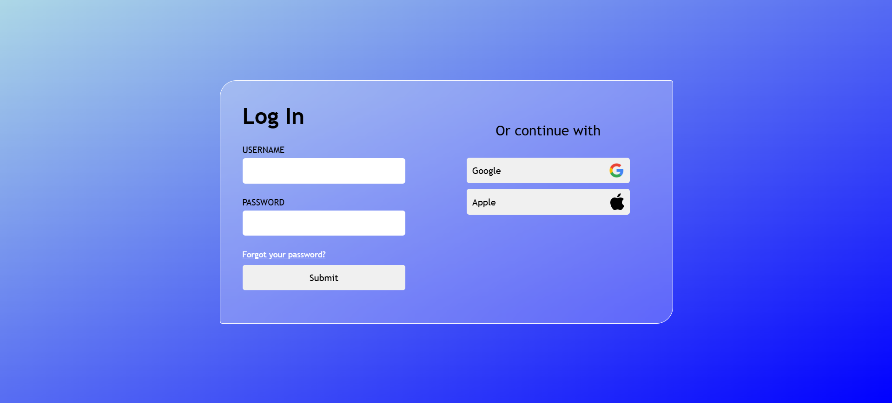
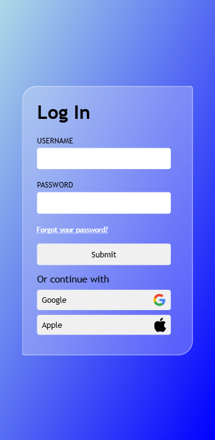

# Responsive Login Page

## Figma Design


## Finished Result



A responsive and accesible login page.

Built with several priorities in mind, namely:
1. Responsiveness
2. All-around accessibility
3. A modern, minimalist design
4. Functional form validation

## Table Of Contents
1. [Installation](#installation)
2. [Usage](#usage)
3. [Tech Stack](#tech-stack)
4. [Project Structure](#project-structure)
5. [Author](#author)
6. [License](#license)
7. [Disclaimer](#disclaimer)

## Installation
Copy this repository's link: 
```
https://github.com/logicalPanda2/login-page-project.git
```
Then, in Git Bash, navigate to the directory you want the cloned directory to be in:
```
$ cd example_directory
```
Then, type in the command `git clone` along with the copied link:
```
$ git clone https://github.com/logicalPanda2/login-page-project.git
```
Wait until all processes are done, indicating the repository is successfully cloned.

## Usage
Navigate to the index.html file in the `src` folder, then open it directly in your browser.

To successfully log in, type in "Bomby" for the username and "Bumba123" for the password!

## Tech Stack
- HTML5
- CSS3 (Flexbox)
- JavaScript (ES6)

## Project Structure
```
/root (login-page-project)
    /assets -> logos
    /designs-and-screenshots -> figma designs and screenshots of finished product
    /src
        loginResult.html
        index.html
        placeholder.html
        script.js
        style.css
        style2.css
```

## Author
Marcelino Romeo @logicalPanda2 (https://github.com/logicalPanda2)

## License
This project is licensed under the <a href="LICENSE.txt">MIT</a> License.

## Disclaimer
This project is a personal project made for educational purposes only.<br>
All names, logos, and brands are property of their respective owners.<br>
Usage and mentions of all names, logos, and brands do not imply any affiliation or endorsement.